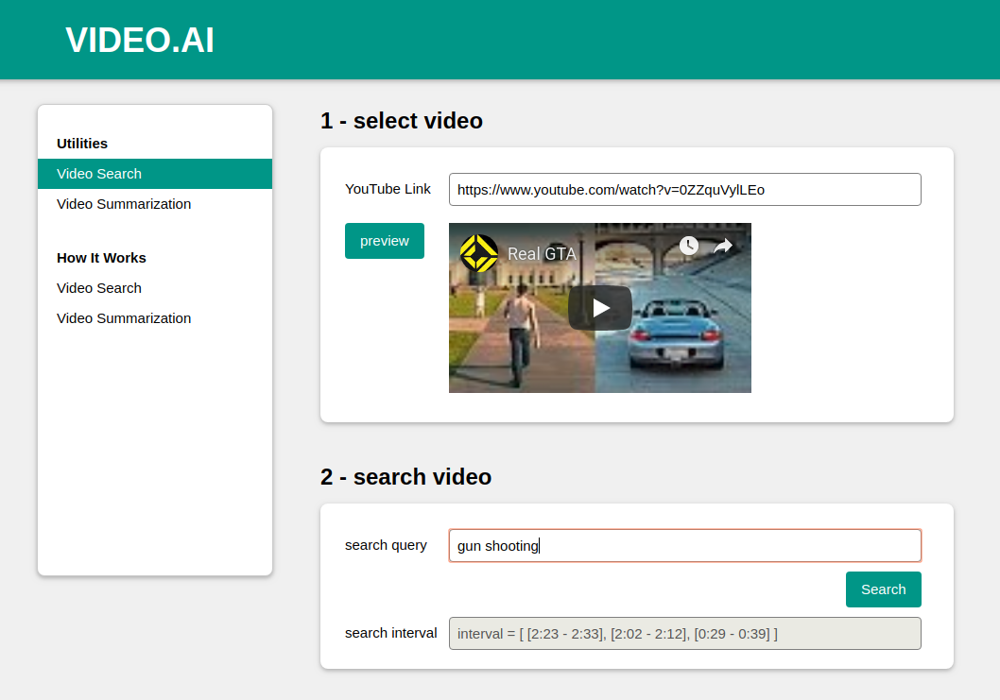

# Multimedita Question Answering

Increasing trend in the research community for video processing using artificial intelligence.
Trending Tasks:
- Video classification.
- Video content description.
- Video question answering (VQA).

# Main Idea

The main idea of the project is that searching for partition of video which is most relevent to a corresponding query "Question".

# Examples

# Dataset

We use the Microsoft Research Video to Text (MSR-VTT) dataset.
Example of the dataset is shown below.

  

# Extracted Visual Feature
We extracted the visual features of the data set using 3 different models.

* ResNet-152 (like paper): [gdrive link](https://drive.google.com/drive/folders/16EANa7XI-pX9vjJJCpQXZeVfHGBIGird?usp=sharing)

* Inception-ResNet-v2: [gdrive link](https://drive.google.com/drive/folders/1X7l0Uc2dij0RZDXfizOZYc1EyRwjfxxG?usp=sharing)

* NASNet: [gdrive link](https://drive.google.com/drive/folders/1-NkhaeHWdrQjdSRhqVVcYCXvZV6vp0tw?usp=sharing)

# Architecture

Here is the base architecture which is used in paper [here](https://arxiv.org/abs/1808.02559).

  

# Checkpoints

We have trained the model using different visual features extractors and changed a bit in the model architecture.

* Using ResNet visual features extractor (like paper): [gdrive link](https://drive.google.com/open?id=11QgK_WM1QUM6-R6FLLDcBxSh1Aj9H13j)

* Using NASNet visual features extractor: [gdrive](https://drive.google.com/open?id=1ulXiHvIg3fZ4xrXIGfUQto84E8oEbBz0)

* Using Inception-ResNet-v2 visual features extractor: [gdrive link](https://drive.google.com/drive/folders/1KHUDPItXL3b0s7ojTZadoObVGX4yFvkw?usp=sharing)

* Using Squeeze and Excitation technique with Inception-ResNet-v2: [gdrive line](https://drive.google.com/open?id=1bB9YenRh-VTFORoBzKBP48028soODyd7)

* Using Dropout technique: [gdrive link](https://drive.google.com/drive/folders/1bSXXHPSpg7jSkC2fUpe86R5naL4CZoHI?usp=sharing)

* Using Squeeze and Excitation along with Dropout: [gdrive link](https://drive.google.com/drive/folders/1-6Av792Htkal_sp9lM_7PwbwGCrejKaE?usp=sharing)

* Using Squeeze and Excitation technique and increasing hidden dimension of the LSTMs: [gdrive link](https://drive.google.com/drive/folders/1XZISh3Jg24jMuChZ5ChOb1kgvOEns2fC?usp=sharing)

# Authors

* [Amr Hendy](https://github.com/AmrHendy)
* [Muhammed Ibrahim](https://github.com/MuhammedKhamis)
* [Abdelrahman Yasser](https://github.com/Abdelrhman-Yasser)
* [Mohammed Shaban](https://github.com/mohamed-shaapan)
* [Arsanuos](https://github.com/Arsanuos)
* [Ahmed Ezzat](https://github.com/AhmedMaghawry) 

# Contribute

Contributions are always welcome!

Please read the [contribution guidelines](contributing.md) first.

# License

This project is licensed under the GNU General Public License v3.0 - see the [LICENSE](LICENSE) file for details

